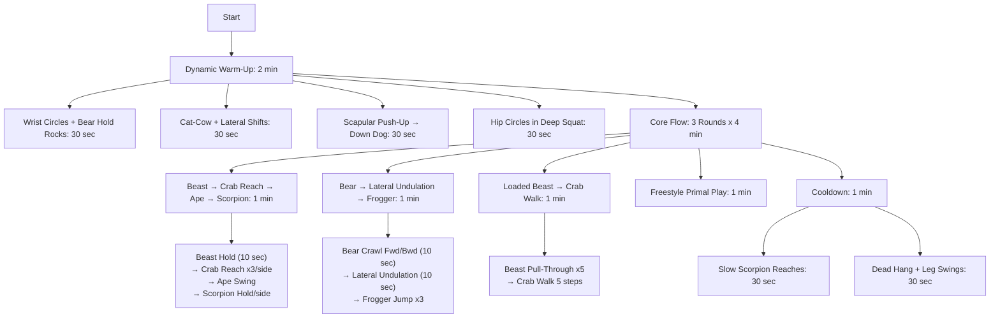

---

### **1. Autophagy: The Cellular "Spring Cleaning"**  
Autophagy is your body’s way of recycling damaged cells, proteins, and mitochondria. Boost it to:  
- **Reverse cellular aging**  
- **Reduce inflammation**  
- **Clear out dysfunctional components** (like zombie cells)  

#### **How to Trigger It Deeply**  
**A. Fasting Protocols:**  
- **16/8 Intermittent Fasting (Daily):** Easy entry; eat within an 8-hour window.  
- **24-36 Hour Fast (1-2x/week):** More autophagy, growth hormone spike.  
- **3-5 Day Fast (Quarterly):** Resets immune stem cells (Dr. Valter Longo’s research).  
  *Pro Tip:* Drink **electrolytes (sodium, potassium, magnesium)** to avoid fatigue.  

**B. Autophagy-Boosting Supplements/Nutrients:**  
- **Spermidine** (in wheat germ, aged cheese) – mimics fasting.  
- **Turmeric/Curcumin** – enhances autophagy pathways.  
- **Green Tea (EGCG)** – ups cellular cleanup.  

**C. Exercise Synergy:**  
- **Train fasted** (morning cardio or resistance work) to amplify autophagy.  
- **Sauna after fasting** – heat shock proteins + autophagy = super-repair.  

---

### **2. Animal Flow: Rehabilitate Like a Primate**  
Animal Flow is **movement-based rehab**—improving mobility, joint resilience, and neuromuscular control by mimicking animals. Unlike gym routines, it:  
- **Restores natural movement patterns** (lost from sitting)  
- **Rebuilds connective tissue** (tendons, fascia)  
- **Enhances body awareness (proprioception)**  

#### **Key Movements for Rejuvenation**  
**A. Foundational Flow (Daily Practice):**  
1. **Bear Crawl** – Resets shoulder/scapula stability.  
2. **Crab Reach** – Opens thoracic spine, counteracts hunching.  
3. **Ape Swings** – Dynamic hip mobility + core tension.  
4. **Scorpion Reach** – Rotational spine health.  

**B. Advanced Rehab Tweaks:**  
- **Slow Eccentrics** (e.g., 5-second descent in Crab walks) – builds tendon strength.  
- **Paused Isometrics** (hold Beast Pose for 30 sec) – deep core/joint stabilization.  

**C. Programming:**  
- **10-15 mins daily** (grease the groove) > 1 long session weekly.  
- **Pair with fasting** – movement enhances autophagy’s effects.  

---

### **Synergy Between Autophagy + Animal Flow**  
1. **Fast + Flow Morning Routine:**  
   - Wake up, hydrate with electrolytes.  
   - 10 min Animal Flow (primal movements in fasted state).  
   - Follow with sauna/cold shower.  
   *Result:* Autophagy cleans cells; Animal Flow rebuilds movement integrity.  

2. **Post-Workout (Fed State) Mobility:**  
   - After eating, do **loaded Animal Flow** (wear a weighted vest) to strengthen new cells.  

3. **Recovery Days:**  
   - 24-hour fast + **only Animal Flow + stretching** – no heavy training.  

---

### **Sample Weekly Plan**  
| **Day**       | **Autophagy Protocol**       | **Animal Flow Practice**        |  
|--------------|---------------------------|-----------------------------|  
| **Mon**      | 16/8 Fasting              | 10 min Dynamic Flow (Bear/Ape) |  
| **Tue**      | 18/6 Fasting + Fasted Lift | 5 min Isometric Holds       |  
| **Wed**      | 24-Hour Fast              | Light Flow + Yoga            |  
| **Thu**      | 16/8 + Spermidine-rich meal | Weighted Crab Walks         |  
| **Fri**      | Train Fasted (Cardio)     | Scorpion Reaches (Spine Focus)|  
| **Sat**      | Feast Day (Cyclic Carbs)  | Play-Based Movement (Outdoors)|  
| **Sun**      | 36-Hour Fast (Optional)   | Rest or Gentle Mobility      |  

---

### **Final Tip:** Track Progress  
- **Autophagy:** Notice clearer skin, better sleep, joint pain reduction.  
- **Animal Flow:** Improved shoulder/hip mobility, fewer "clicky" joints.  

---

### **Animal Flow Routine Exercise Guide**
| **Exercise**               | **Technique Cues**                                                                 | **Primary Muscles Targeted**                     | **Rehab/Rejuvenation Benefit**                                                                 |
|----------------------------|------------------------------------------------------------------------------------|--------------------------------------------------|------------------------------------------------------------------------------------------------|
| **Wrist Circles + Bear Hold Rocks** | Rotate wrists in all directions, then rock forward/back in Beast position (knees hover). | Forearms, shoulders, core.                      | Prepares wrists/shoulders for load; enhances synovial fluid circulation.                        |
| **Cat-Cow + Lateral Shifts**       | Arch/spine with breath, then shift hips side-to-side in tabletop.                   | Spinal erectors, obliques, hips.                | Restores spinal segmentation + rib mobility.                                                   |
| **Scapular Push-Up → Down Dog**    | Protract/retract scapulae in plank, then push hips back to Down Dog.               | Serratus anterior, lats, hamstrings.            | Rehabilitates scapular control (critical for shoulder health).                                 |
| **Hip Circles in Deep Squat**      | Hold squat, rotate hips in circles (keep heels down).                              | Hip flexors, glutes, ankles.                    | Mobilizes stiff hips; improves squat depth.                                                    |
| **Beast Hold**                     | Knees hover 1" off ground, ribs tucked, tense entire body.                         | Deep core, quads, shoulders.                    | Builds anti-extension core strength; protects spine under load.                                |
| **Crab Reach**                     | Lift hips in Crab position, reach one hand across to opposite foot.                | Thoracic spine, triceps, glutes.                | Reverses hunched posture; opens anterior chain.                                                |
| **Ape Swing**                      | From squat, swing arms explosively to one side, land softly.                       | Adductors, obliques, shoulders.                 | Trains rotational power + deceleration (injury prevention).                                    |
| **Scorpion Reach**                 | Lying prone, reach heel to opposite hand behind.                                   | Rotator cuff, thoracic spine, hip flexors.      | Restores rotational mobility; counters sedentary stiffness.                                    |
| **Bear Crawl**                     | Crawl forward/backward with knees 1" off ground.                                  | Shoulders, wrists, core.                        | Enhances cross-body coordination + shoulder stability.                                         |
| **Lateral Undulation**             | Sideways Bear Crawl with rib cage leading.                                        | Obliques, serratus, hip abductors.              | Trains lateral fascial lines (often neglected in gym training).                                |
| **Frogger Jump**                   | From deep squat, explode up, land silently.                                       | Quads, Achilles, core.                          | Builds tendon resilience for jumping/landing.                                                 |
| **Beast Pull-Through**             | Drag imaginary weight under torso while in Beast position.                         | Rotator cuff, obliques, hip flexors.            | Rehabs shoulder/hip stability under tension.                                                  |
| **Crab Walk**                      | Walk forward/backward in Crab position (hips high).                               | Glutes, triceps, hamstrings.                    | Strengthens posterior chain; counters excessive sitting.                                       |
| **Freestyle Primal Play**          | Improvise rolls, jumps, or hangs.                                                 | Full-body integration.                          | Enhances neuroplasticity + creativity in movement.                                             |
| **Dead Hang + Leg Swings**         | Passive hang from bar, add gentle leg swings.                                     | Lats, shoulders, spinal decompression.          | Resets shoulder alignment; relieves spinal compression.                                        |

---

### **Key Notes for Elite Performance**  
- **Fasted?** Focus on **slow eccentrics** (e.g., 3-sec Crab Reach descents) to amplify autophagy.  
- **Weighted?** Add a **5-10lb vest** to Beast/Crab movements for strength stimulus.  
- **Rehab Priority:** Spend extra time on **Scorpion Reach** if desk-bound, **Beast Pull-Through** if shoulders are fatigued from training.  

Need modifications for a specific goal (e.g., more hip focus, less wrist demand)?