---

### **1. Autophagy: The Cellular "Spring Cleaning"**  
Autophagy is your body’s way of recycling damaged cells, proteins, and mitochondria. Boost it to:  
- **Reverse cellular aging**  
- **Reduce inflammation**  
- **Clear out dysfunctional components** (like zombie cells)  

#### **How to Trigger It Deeply**  
**A. Fasting Protocols:**  
- **16/8 Intermittent Fasting (Daily):** Easy entry; eat within an 8-hour window.  
- **24-36 Hour Fast (1-2x/week):** More autophagy, growth hormone spike.  
- **3-5 Day Fast (Quarterly):** Resets immune stem cells (Dr. Valter Longo’s research).  
  *Pro Tip:* Drink **electrolytes (sodium, potassium, magnesium)** to avoid fatigue.  

**B. Autophagy-Boosting Supplements/Nutrients:**  
- **Spermidine** (in wheat germ, aged cheese) – mimics fasting.  
- **Turmeric/Curcumin** – enhances autophagy pathways.  
- **Green Tea (EGCG)** – ups cellular cleanup.  

**C. Exercise Synergy:**  
- **Train fasted** (morning cardio or resistance work) to amplify autophagy.  
- **Sauna after fasting** – heat shock proteins + autophagy = super-repair.  

---

### **2. Animal Flow: Rehabilitate Like a Primate**  
Animal Flow is **movement-based rehab**—improving mobility, joint resilience, and neuromuscular control by mimicking animals. Unlike gym routines, it:  
- **Restores natural movement patterns** (lost from sitting)  
- **Rebuilds connective tissue** (tendons, fascia)  
- **Enhances body awareness (proprioception)**  

#### **Key Movements for Rejuvenation**  
**A. Foundational Flow (Daily Practice):**  
1. **Bear Crawl** – Resets shoulder/scapula stability.  
2. **Crab Reach** – Opens the thoracic spine, counteracts hunching.  
3. **Ape Swings** – Dynamic hip mobility + core tension.  
4. **Scorpion Reach** – Rotational spine health.  

**B. Advanced Rehab Tweaks:**  
- **Slow Eccentrics** (e.g., 5-second descent in Crab walks) – builds tendon strength.  
- **Paused Isometrics** (hold Beast Pose for 30 sec) – deep core/joint stabilization.  

**C. Programming:**  
- **10-15 mins daily** (grease the groove) > 1 long session weekly.  
- **Pair with fasting** – movement enhances autophagy’s effects.  

---

### **Synergy Between Autophagy + Animal Flow**  
1. **Fast + Flow Morning Routine:**  
   - Wake up, hydrate with electrolytes.  
   - 10 min Animal Flow (primal movements in fasted state).  
   - Follow with sauna/cold shower.  
   *Result:* Autophagy cleans cells; Animal Flow rebuilds movement integrity.  

2. **Post-Workout (Fed State) Mobility:**  
   - After eating, do **loaded Animal Flow** (wear a weighted vest) to strengthen new cells.  

3. **Recovery Days:**  
   - 24-hour fast + **only Animal Flow + stretching** – no heavy training.  

---

### **Sample Weekly Plan**  
| **Day**       | **Autophagy Protocol**       | **Animal Flow Practice**        |  
|--------------|---------------------------|-----------------------------|  
| **Mon**      | 16/8 Fasting              | 10 min Dynamic Flow (Bear/Ape) |  
| **Tue**      | 18/6 Fasting + Fasted Lift | 5 min Isometric Holds       |  
| **Wed**      | 24-Hour Fast              | Light Flow + Yoga            |  
| **Thu**      | 16/8 + Spermidine-rich meal | Weighted Crab Walks         |  
| **Fri**      | Train Fasted (Cardio)     | Scorpion Reaches (Spine Focus)|  
| **Sat**      | Feast Day (Cyclic Carbs)  | Play-Based Movement (Outdoors)|  
| **Sun**      | 36-Hour Fast (Optional)   | Rest or Gentle Mobility      |  

---

### **Final Tip:** Track Progress  
- **Autophagy:** Notice clearer skin, better sleep, joint pain reduction.  
- **Animal Flow:** Improved shoulder/hip mobility, fewer "clicky" joints.  

```mermaid
flowchart TD
    A[Start] --> B[Dynamic Warm-Up: 2 min]
    B --> B1[Wrist Circles + Bear Hold Rocks: 30 sec]
    B --> B2[Cat-Cow + Lateral Shifts: 30 sec]
    B --> B3[Scapular Push-Up → Down Dog: 30 sec]
    B --> B4[Hip Circles in Deep Squat: 30 sec]
    
    B --> C[Core Flow: 3 Rounds x 4 min]
    C --> C1[Beast → Crab Reach → Ape → Scorpion: 1 min]
    C1 --> C1a["Beast Hold (10 sec)<br>→ Crab Reach x3/side<br>→ Ape Swing<br>→ Scorpion Hold/side"]
    
    C --> C2[Bear → Lateral Undulation → Frogger: 1 min]
    C2 --> C2a["Bear Crawl Fwd/Bwd (10 sec)<br>→ Lateral Undulation (10 sec)<br>→ Frogger Jump x3"]
    
    C --> C3[Loaded Beast → Crab Walk: 1 min]
    C3 --> C3a["Beast Pull-Through x5<br>→ Crab Walk 5 steps"]
    
    C --> C4[Freestyle Primal Play: 1 min]
    
    C --> D[Cooldown: 1 min]
    D --> D1[Slow Scorpion Reaches: 30 sec]
    D --> D2[Dead Hang + Leg Swings: 30 sec]
```

---

### **Animal Flow Routine Exercise Guide**
| **Exercise**               | **Technique Cues**                                                                 | **Primary Muscles Targeted**                     | **Rehab/Rejuvenation Benefit**                                                                 |
|----------------------------|------------------------------------------------------------------------------------|--------------------------------------------------|------------------------------------------------------------------------------------------------|
| **Wrist Circles + Bear Hold Rocks** | Rotate wrists in all directions, then rock forward/back in Beast position (knees hover). | Forearms, shoulders, core.                      | Prepares wrists/shoulders for load; enhances synovial fluid circulation.                        |
| **Cat-Cow + Lateral Shifts**       | Arch/spine with breath, then shift hips side-to-side in tabletop.                   | Spinal erectors, obliques, hips.                | Restores spinal segmentation + rib mobility.                                                   |
| **Scapular Push-Up → Down Dog**    | Protract/retract scapulae in plank, then push hips back to Down Dog.               | Serratus anterior, lats, hamstrings.            | Rehabilitates scapular control (critical for shoulder health).                                 |
| **Hip Circles in Deep Squat**      | Hold squat, rotate hips in circles (keep heels down).                              | Hip flexors, glutes, and ankles.                    | Mobilizes stiff hips; improves squat depth.                                                    |
| **Beast Hold**                     | Knees hover 1" off the ground, ribs tucked, tense entire body.                         | Deep core, quads, shoulders.                    | Builds anti-extension core strength; protects spine under load.                                |
| **Crab Reach**                     | Lift hips in Crab position, reach one hand across to the opposite foot.                | Thoracic spine, triceps, glutes.                | Reverses hunched posture; opens anterior chain.                                                |
| **Ape Swing**                      | From squat, swing arms explosively to one side, land softly.                       | Adductors, obliques, shoulders.                 | Trains rotational power + deceleration (injury prevention).                                    |
| **Scorpion Reach**                 | Lying prone, reach heel to opposite hand behind.                                   | Rotator cuff, thoracic spine, hip flexors.      | Restores rotational mobility; counters sedentary stiffness.                                    |
| **Bear Crawl**                     | Crawl forward/backward with knees 1" off ground.                                  | Shoulders, wrists, core.                        | Enhances cross-body coordination + shoulder stability.                                         |
| **Lateral Undulation**             | Sideways Bear Crawl with rib cage leading.                                        | Obliques, serratus, hip abductors.              | Trains lateral fascial lines (often neglected in gym training).                                |
| **Frogger Jump**                   | From deep squat, explode up, land silently.                                       | Quads, Achilles, core.                          | Builds tendon resilience for jumping/landing.                                                 |
| **Beast Pull-Through**             | Drag imaginary weight under torso while in Beast position.                         | Rotator cuff, obliques, hip flexors.            | Rehabs shoulder/hip stability under tension.                                                  |
| **Crab Walk**                      | Walk forward/backward in Crab position (hips high).                               | Glutes, triceps, hamstrings.                    | Strengthens posterior chain; counters excessive sitting.                                       |
| **Freestyle Primal Play**          | Improvise rolls, jumps, or hangs.                                                 | Full-body integration.                          | Enhances neuroplasticity + creativity in movement.                                             |
| **Dead Hang + Leg Swings**         | Passive hang from bar, add gentle leg swings.                                     | Lats, shoulders, spinal decompression.          | Resets shoulder alignment; relieves spinal compression.                                        |

---
- Wrist Circles + Bear Hold Rocks (https://www.youtube.com/watch?v=TWzJgjz-XO4)
- Cat-Cow + Lateral Shifts (https://www.youtube.com/watch?v=G9lADOadlmA&pp=ygUYQ2F0LUNvdyArIExhdGVyYWwgU2hpZnRz)
- Scapular Push-Up → Down Dog(https://www.youtube.com/watch?v=QRWQfIgtpY8&pp=ygUdU2NhcHVsYXIgUHVzaC1VcCDihpIgRG93biBEb2c%3D)
- Hip Circles in Deep Squat (https://www.youtube.com/shorts/vur9ps_EM6E)
- Beast Hold (https://www.youtube.com/watch?v=bLGd7ZzvjVo&pp=ygUcYmVhc3QgaG9sZCBtb3ZlbWVudCBjcm9zc2ZpdA%3D%3D)
- Crab Reach (https://www.youtube.com/watch?v=rsBVxRzMMik&pp=ygUKQ3JhYiBSZWFjaNIHCQmwCQGHKiGM7w%3D%3D)
- Ape Swing ()
- Scorpion Reach (https://www.youtube.com/watch?v=bmENm-7Ut_Y&pp=ygUOc2NvcnBpb24gcmVhY2g%3D)
- Bear Crawl (https://www.youtube.com/watch?v=qpaxI2m75RY&pp=ygUTYmVhciBjcmF3bCBleGVyY2lzZQ%3D%3D)
- Lateral Undulation (https://www.youtube.com/shorts/0U47qlHGmog)
- Frogger Jump (https://www.youtube.com/watch?v=ueGvIOHMZG0&pp=ygUXZnJvZ2dlciBqdW1wZXIgZXhlcmNpc2U%3D)
- Beast Pull-Through (https://www.youtube.com/watch?v=1GWbVhsFvs0&pp=ygUSQmVhc3QgUHVsbC1UaHJvdWdo)
- Crab Walk (https://www.youtube.com/watch?v=NZnV6F9OGHY&pp=ygUSY3JhYiB3YWxrIGV4ZXJjaXNl0gcJCbAJAYcqIYzv)
- Freestyle Primal Play 
- Dead Hang + Leg Swings 

### **Key Notes for Elite Performance**  
- **Fasted?** Focus on **slow eccentric** (e.g., 3-sec Crab Reach descents) to amplify autophagy.  
- **Weighted?** Add a **5-10lb vest** to Beast/Crab movements for strength stimulus.  
- **Rehab Priority:** Spend extra time on **Scorpion Reach** if desk-bound, **Beast Pull-Through** if shoulders are fatigued from training.  

#Diet

For **24-hour fasts** (and longer), the goal is to **support autophagy, electrolytes, and energy** *without breaking the fast*. Here’s exactly what to ingest—and what to avoid—to maximize benefits while minimizing discomfort.  

---

### **✅ What to Ingest During a 24-Hour Fast**  
| **Category**       | **What to Take**                          | **Why?**                                                                 | **Dosing/Timing**                     |  
|--------------------|-------------------------------------------|--------------------------------------------------------------------------|---------------------------------------|  
| **Electrolytes**   | - **Sodium** (Himalayan salt, sea salt)   | Prevents headaches, fatigue, and dizziness (lost through urine/sweat).  | ½ tsp in water (2-3x during fast).    |  
|                    | - **Potassium** (NoSalt, cream of tartar) | Balances sodium; prevents muscle cramps/heart palpitations.              | ¼ tsp in water (1-2x).                |  
|                    | - **Magnesium** (Glycinate, citrate)      | Reduces muscle cramps, improves sleep. Avoid oxide (poor absorption).   | 200-400mg before bed.                 |  
| **Hydration**      | - **Water** (still or sparkling)          | Prevents dehydration. Add lemon/lime *wedge* (no juice) for minerals.   | 2-3L total (sip steadily).            |  
| **Autophagy Boosters** | - **Black coffee** (no sugar/cream)    | Increases autophagy by 30-50% (per rodent studies).                      | 1-2 cups max (avoid if cortisol-sensitive). |  
|                    | - **Green tea** (plain, no additives)     | EGCG enhances fat oxidation + cellular cleanup.                         | 2-3 cups spaced out.                  |  
| **Gut Support**    | - **Bone broth** (controversial)          | *Only if weak/lightheaded*—technically breaks fast but spares muscle.   | 1 cup max (homemade, no additives).   |  

---

### **❌ What to Avoid (Breaks Fast/Blocks Autophagy)**  
- **Sweeteners** (even stevia/monk fruit)—can trigger insulin.  
- **BCAAs/protein**—activates mTOR (blocks autophagy).  
- **Juices or milk**—spikes blood sugar.  
- **Gum/mints**—artificial sweeteners may increase hunger.  

---

### **Sample 24-Hour Fast Protocol**  
**6 AM:**  
- Black coffee + ½ tsp salt in water.  

**10 AM:**  
- Green tea + ¼ tsp potassium (NoSalt).  

**2 PM:**  
- Sparkling water + lemon wedge.  

**6 PM:**  
- Magnesium glycinate + pinch of salt.  

**10 PM (if needed):**  
- *Optional* bone broth (only if dizzy).  

---

### **Pro Tips for Extended Fasts**  
1. **Train Smart:** Do **low-intensity cardio or Animal Flow** (no heavy lifting).  
2. **Sleep Deeply:** Fasting increases **growth hormone**—prioritize 7-9 hours.  
3. **Break Fast Wisely:** Start with **easily digestible protein + healthy fats** (e.g., eggs, avocado).  

---

### **When to Stop Immediately**  
- Extreme dizziness, irregular heartbeat, or vomiting (likely electrolyte imbalance).  
- Hypoglycemia symptoms (shaking, confusion)—try **pinch of salt under tongue**.  

Need a tweaked version for your activity level (e.g., fasting on training days)?

---

# Schedule

Here’s your **full weekly schedule** (adjusted to your 24-hour fast from **Thursday 2 PM → Friday 2 PM**) and a **separate diet table** for meal planning.  

---

### **Weekly Schedule (Rejuvenation Focus)**  
**Key:**  
- **IF** = Intermittent Fasting | **AF** = Animal Flow  
- **🔥** = Strength | **🏃** = Cardio | **💤** = Recovery  

| **Day**  | **Fasting Window**   | **Primary Focus**       | **Key Activities**                                  |  
|----------|----------------------|-------------------------|----------------------------------------------------|  
| **Mon**  | 16/8 (Skip Breakfast)| Metabolic Reset         | AM: Fasted AF + Zone 2 Cardio PM: Upper Body Lift |  
| **Tue**  | 18/6 (Late Lunch)    | Strength + Mobility     | Lower Body Lift + Loaded AF (weighted vest)        |  
| **Wed**  | 16/8 (Skip Breakfast)| Power/Explosiveness     | Power Cleans + Sprints + Mobility AF               |  
| **Thu**  | **24h Fast** (2 PM → 2 PM) | Deep Autophagy     | Light AF + Electrolytes + Sauna                    |  
| **Fri**  | 12h Fast (8 PM → 8 AM) | Refeed + Rebuild    | Break fast with eggs/avocado → PM Lift              |  
| **Sat**  | 14/10 (Overnight)    | Feast + Play            | Sprint Intervals + Primal Movement Hike            |  
| **Sun**  | Optional 36h Fast    | Recharge                | Float Tank + Restorative Yoga/AF                   |  

---

### **Weekly Diet Plan (Optimized for Rejuvenation)**  
**Goals:** Support fasting, muscle retention, and autophagy.  

| **Day**  | **Meal 1**               | **Meal 2**               | **Meal 3 (If Fed)**      | **Key Notes**                          |  
|----------|--------------------------|--------------------------|--------------------------|----------------------------------------|  
| **Mon**  | — (Fasted)               | Ribeye + Sweet Potato    | Salmon + Asparagus       | High-protein post-fast.                |  
| **Tue**  | Venison + White Rice     | Eggs + Kimchi + Almond Butter | —                  | Carbs post-lift.                      |  
| **Wed**  | — (Fasted)               | Bison + Pineapple        | Sardines + Squash        | Glycogen replenishment.               |  
| **Thu**  | — (24h Fast Starts 2 PM) | Bone Broth (2 PM Fri)    | Ribeye + Avocado         | Break fast gently.                    |  
| **Fri**  | Eggs + Avocado           | Chicken + Jasmine Rice   | —                       | Moderate carbs post-workout.          |  
| **Sat**  | Cheat    | Cheat      | Cheat     | Feast day for mental satisfaction.     |  
| **Sun**  | — (Optional 36h Fast)    | Bone Broth → Salmon      | —                       | Prioritize omega-3s for recovery.     |  

---

### **Critical Diet Rules:**  
1. **Fasting Days:** Hydrate with electrolytes (sodium, potassium, magnesium).  
2. **Post-Fast:** Always break with **protein + fat** (e.g., eggs, avocado) before carbs.  
3. **Feast Days:** Carb-heavy meals go **post-workout** (e.g., rice, sweet potato).  
4. **Avoid:** Processed sugar, seed oils, alcohol (blocks autophagy).  

---

### **Optional Upgrades:**  
- **For More Autophagy:** Add **spermidine** (wheat germ, aged cheese) on fed days.  
- **For Gut Health:** Fermented foods (kimchi, sauerkraut) daily.  

